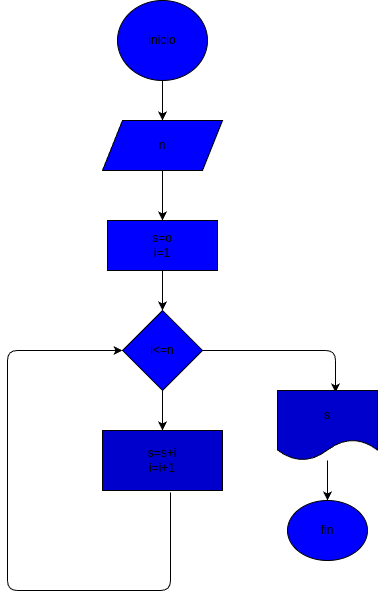

# while_1
primer programa de bucle

# analisis

## input

### variables

s= la suma de los n primeros numeros

i= es la variable utilizada para poder cumar los n primeros numeros

### processing

while i<=n:

    s=s+i
    i=i+1

# diseño

"diagrama de flujo"
